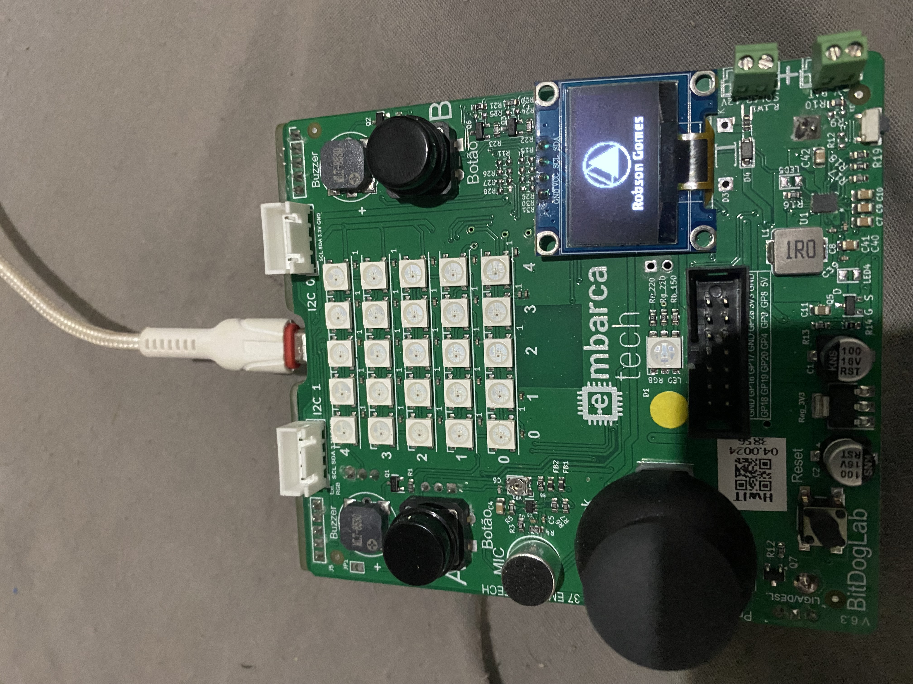

# Display Oled BitDogLab

O projeto consiste em controlar o display Oled na placa BitDogLab (Pico W) apresentando textos, linha e imagem (logo).

> **Importante**: esse projeto foi criado com a versão 1.5.1 do SDK

## Formato da logo

A logo precisa ser do tamanho 128x64 pixels e precisa ser tratada para ser convertida em um array antes de ser enviada ao display. Nesse projeto foi utilizado o site https://javl.github.io/image2cpp/ para conversão da imagem.

## Demo

